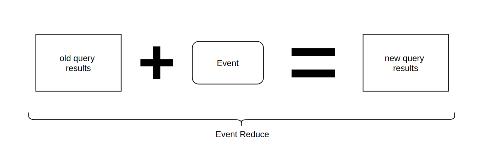

 

<h1 align="center">Event-Reduce</h1>

  <strong>An algorithm to optimize database queries that run multiple times</strong>

 

* * *

 

<ul>
    <li>1. You make a query to the database which returns the result in 100 milliseconds</li>
    <li>2. A write event occurs on the database and changes some data</li>
    <li>3. To get the new version of the query's results you now have three options:</li>
    <ul>
        <li>a. Run the query over the database again which takes another 100 milliseconds</li>
        <li>
            b. Write complex code that somehow merges the incoming event with the old state
        </li>
        <li>
            c. Use <b>Event-Reduce</b> to calculate the new results on the CPU without disc-IO <b>nearly instant</b>
        </li>
    </ul>
</ul>

 

    

 

## Efficiency

In the [browser demo](https://pubkey.github.io/event-reduce) you can see that for randomly generated events, about **94%** of them could be optimized by EventReduce. In real world usage, with non-random events, this can be even higher. For the different implementations in common browser databases, we can observe an up to **12 times** faster displaying of new query results after a write occurred.

## How they do it

EventReduce uses 17 different `state functions` to 'describe' an event+previousResults combination. A state function is a function that returns a boolean value like `isInsert()`, `wasResultsEmpty()`, `sortParamsChanged()` and so on.

Also there are 14 different `action functions`. An action function gets the event+previousResults and modifies the results array in a given way like `insertFirst()`, `replaceExisting()`, `insertAtSortPosition()`, `doNothing()` and so on.

For each of our `2^17` state combinations, we calculate which action function gives the same results that the database would return when the full query is executed again.

From this state-action combinations we create a big truth table that is used to create a [binary decision diagram](https://github.com/pubkey/binary-decision-diagram). The BDD is then optimized to call as few `state functions` as possible to determine the correct action of an incoming event-results combination.

The resulting optimized BDD is then shipped as the EventReduce algoritm and can be used in different programming languages and implementations. The programmer does not need to know about all this optimisation stuff and can directly use three simple functions like shown in the [javascript implementation](https://github.com/pubkey/event-reduce/tree/master/javascript)

## When to use this

You can use this to

* reduce the latency until a change to the database updates your application
* make observing query results more scalable by doing less disk-io
* reduce the bandwith when streaming realtime query results from the backend to the client
* create a better form of caching where instead of invalidating the cache on write, you update its content

## Limitations

- EventReduce only works with queries that have a [predictable](https://stackoverflow.com/a/11599283) sort-order for any given documents. (you can make any query predicable by adding the primary key as last sort parameter)

- EventReduce can be used with relational databases but not on relational queries that run over multiple tables/collections. (you can use views as workarround so that you can query over only one table). In theory Event-Reduce could also be used for realational queries but I did not need this for now. Also it takes about one week on an average machine to run all optimizations, and having more state functions looks like an NP problem.

## Implementations

At the moment there is only the [JavaScript implementation](./javascript/) that you can use over npm. Pull requests for other languages are welcomed.

## Previous Work

- [Noria](https://github.com/mit-pdos/noria) uses the same principle of recomputing the query results incrementally on table writes, but it also works with complex relational queries, and on queries over multiple tables. 
- Meteor uses a feature called [OplogDriver](https://github.com/meteor/docs/blob/master/long-form/oplog-observe-driver.md) that is limited on queries that do not use `skip` or `sort`. Also watch [this video](https://www.youtube.com/watch?v=_dzX_LEbZyI) to learn how OpLogDriver works.

- RxDB used the [QueryChangeDetection](https://github.com/pubkey/rxdb/blob/a7202ac7e2985ff088d53d6a0c86d90d0b438467/docs-src/query-change-detection.md) which works by many handwritten if-else comparisons. RxDB will switch to EventReduce in it's next major release.

- Baqend is [creating a database](https://vsis-www.informatik.uni-hamburg.de/getDoc.php/publications/620/invalidb_4-pages.pdf) that optimizes for realtime queries. Watch the video [Real-Time Databases Explained: Why Meteor, RethinkDB, Parse & Firebase Don't Scale](https://www.youtube.com/watch?v=HiQgQ88AdYo&t=1703s) to learn more.

## FAQ

  
Is this something like materialized views?

  Yes and no. Materialized views solve a similar problem but in a different way with different trade-offs. When you have many users, all subscribing to <b>different queries</b>, you cannot create that many views because they are all recalculated on each write access to the database. EventReduce however has better scalability because it does not affect write performance and the calculation is done when the fresh query results are requested, not beforehand.

  
Is this something like event sourcing or CQRS?

  No, event sourcing is mostly used to calculate a current state by attaching the full event stream to the starting state. This allows for stuff like time travel and so on. EventReduce solves a completely different (performance-) problem and only shares some common keywords like <b>event</b>.

  
Isn't this optimization already done by database engines?

  No. I tested EventReduce with many common databases like MongoDB, MySQL and Postgres. Each of them had better performance with Event-Reduce then just observing the eventstream and running the queries again. If you understand what Event-Reduce exactly does, it comes clear that this optimization can not done by pull-based databases because they have missing information.

